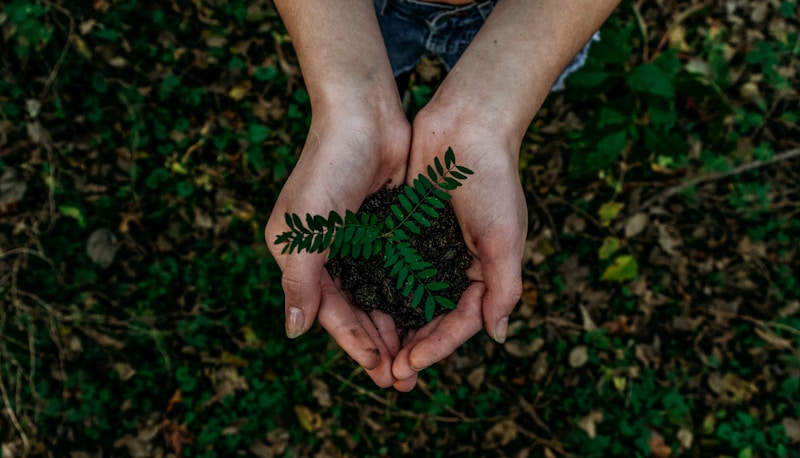

# Shinrin Bonsai — Website

Diese Website besteht aus 5 HTML-Seiten und einem `assets`-Ordner mit allen Bildern.
Alle Bilder lassen sich einfach austauschen — einfach die Datei mit demselben Namen ersetzen.

## Ordnerstruktur

```
shinrin-bonsai-website/
├── index.html              Startseite
├── geschichte.html         Geschichte / Über uns
├── produkte.html           Produkte mit Warenkorb
├── kontakt.html            Kontaktformular
├── impressum.html          Rechtliche Pflichtangaben
└── assets/
    └── images/
        ├── logo-icon.png            Logo im Header (klein, quadratisch)
        ├── logo-siegel.png          Logo-Siegel im Hero-Bild (mit Schriftzug)
        ├── hero-baum.jpg            Großes Bild im Hero-Bereich der Startseite
        ├── atelier-detail.jpg       Bild in der Kurzvorstellung (Startseite)
        ├── portrait.jpg             Porträtfoto auf der Geschichte-Seite (aktuell nicht eingebunden, siehe unten)
        ├── werkstatt-startseite-1.jpg   Werkstatt-Galerie, Startseite (Bild 1 von 2)
        ├── werkstatt-startseite-2.jpg   Werkstatt-Galerie, Startseite (Bild 2 von 2)
        ├── werkstatt-startseite-3.jpg   Reserve / aktuell nicht eingebunden
        ├── werkstatt-wurzelarbeit.jpg   Werkstatt-Galerie, Geschichte-Seite (Bild 1 von 3)
        ├── werkstatt-fenster.jpg        Werkstatt-Galerie, Geschichte-Seite (Bild 2 von 3)
        ├── werkstatt-versand.jpg        Werkstatt-Galerie, Geschichte-Seite (Bild 3 von 3)
        └── produkte/
            ├── schwarzkiefer.jpg        Produktbild "Japanische Schwarzkiefer"
            ├── ulme.jpg                 Produktbild "Chinesisches Ulmenbäumchen"
            ├── fenster-ulme.jpg         Produktbild "Bonsai am Fenster, Ulme"
            ├── schale-erdton.jpg        Vorbereitet für Schale (siehe Hinweis unten)
            ├── schale-moosgruen.jpg     Vorbereitet für Schale (siehe Hinweis unten)
            └── schneideset.jpg          Vorbereitet für Werkzeug (siehe Hinweis unten)
```

## Eigene Bilder einbinden

**So einfach geht's:** Datei im `assets/images`-Ordner durch ein eigenes Bild ersetzen —
**gleicher Dateiname, gleiche Dateiendung**. Kein Code-Eingriff nötig.

Beispiel: Eigenes Hero-Foto einbauen → eigene Datei in `hero-baum.jpg` umbenennen
und die vorhandene Datei im `assets/images`-Ordner damit überschreiben.

### Empfohlene Bildmaße

| Datei | Empfohlene Maße | Format |
|---|---|---|
| `logo-icon.png` | 96 × 96 px | PNG (quadratisch) |
| `logo-siegel.png` | ca. 320 × 263 px | PNG |
| `hero-baum.jpg` | mind. 1200 × 1500 px (Hochformat 4:5) | JPG |
| `atelier-detail.jpg` | mind. 900 × 1080 px (Hochformat) | JPG |
| `portrait.jpg` | mind. 900 × 1125 px (Hochformat 4:5) | JPG |
| Werkstatt-Bilder (alle) | mind. 600 × 750 px (Hochformat 4:5) | JPG |
| Produktbilder (alle) | mind. 700 × 875 px (Hochformat 4:5) | JPG |

Die Bilder werden per CSS automatisch zugeschnitten (`object-fit: cover`) — sie müssen also
nicht pixelgenau passen, aber je näher am angegebenen Seitenverhältnis, desto weniger wird abgeschnitten.

### Porträtfoto auf der Geschichte-Seite einbauen

Aktuell ist dort **bewusst kein Foto** eingebunden — die Fläche zeigt einen Platzhalter-Hinweis
("Foto folgt"), da kein echtes Foto vorlag. Die Datei `portrait.jpg` liegt bereits vorbereitet
im `assets/images`-Ordner.

Um sie zu aktivieren: in `geschichte.html` nach `id="portrait-frame"` suchen und die Zeile

```html
<div class="portrait-frame img-fallback" id="portrait-frame">
  <span class="portrait-frame-note">Foto folgt — authentisches Porträt bei der Arbeit am Bonsai</span>
</div>
```

ersetzen durch:

```html
<div class="portrait-frame" id="portrait-frame">
  
</div>
```

### Fotos statt Icons für Schale & Werkzeug (Produkte-Seite)

Aktuell zeigen die Produkte "Schale" und "Werkzeug" auf der Produkte-Seite gezeichnete Icon-Kacheln
statt Fotos (es lag noch kein passendes Bildmaterial vor). Die Dateien `schale-erdton.jpg`,
`schale-moosgruen.jpg` und `schneideset.jpg` liegen bereits vorbereitet in `assets/images/produkte/`.

Um auf echte Fotos umzustellen: in `produkte.html` im Bereich `const PRODUCTS = [...]` bei den
jeweiligen Produkten (`id: "p4"`, `"p5"`, `"p6"`) die Zeilen

```js
icon: "bowl",
iconVariant: "",
```

ersetzen durch:

```js
img: "assets/images/produkte/schale-erdton.jpg",
```

(entsprechend für `schale-moosgruen.jpg` bei p5 und `schneideset.jpg` bei p6).

## Seiten lokal ansehen

Einfach `index.html` per Doppelklick im Browser öffnen — kein Server nötig, alle Seiten
funktionieren auch offline. Die Navigation verlinkt automatisch zwischen den fünf Seiten.

## Platzhalter-Inhalte, die noch ersetzt werden sollten

- **Bilder:** Alle Fotos sind aktuell rot-grüne "PLATZHALTER"-Grafiken — siehe Tabelle oben
- **Texte:** Platzhalter-Claims und Beispieltexte (z. B. "Vor einigen Jahren entdeckte …")
- **Produktdaten:** Namen, Preise, Beschreibungen in `produkte.html` (`const PRODUCTS`)
- **Kontaktdaten:** E-Mail-Adresse `kontakt@shinrin-bonsai.de` in `index.html`, `kontakt.html`,
  `produkte.html` und `impressum.html`
- **Impressum:** Alle mit `[Platzhalter]` markierten Pflichtangaben in `impressum.html`
